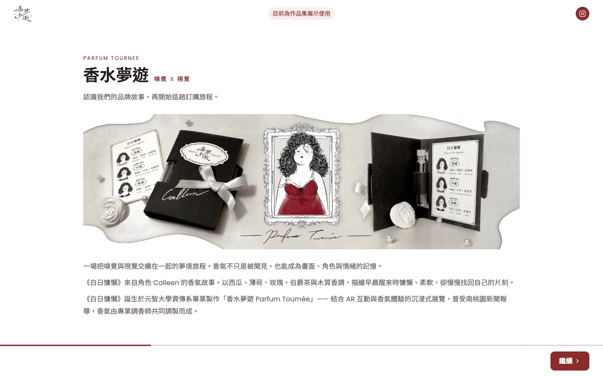
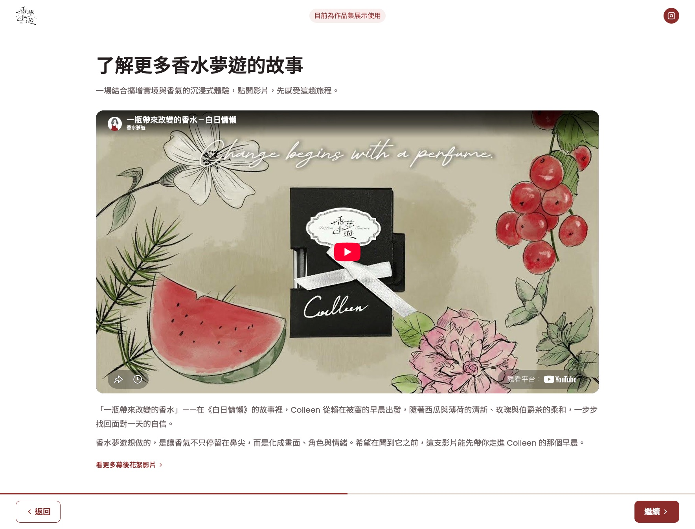
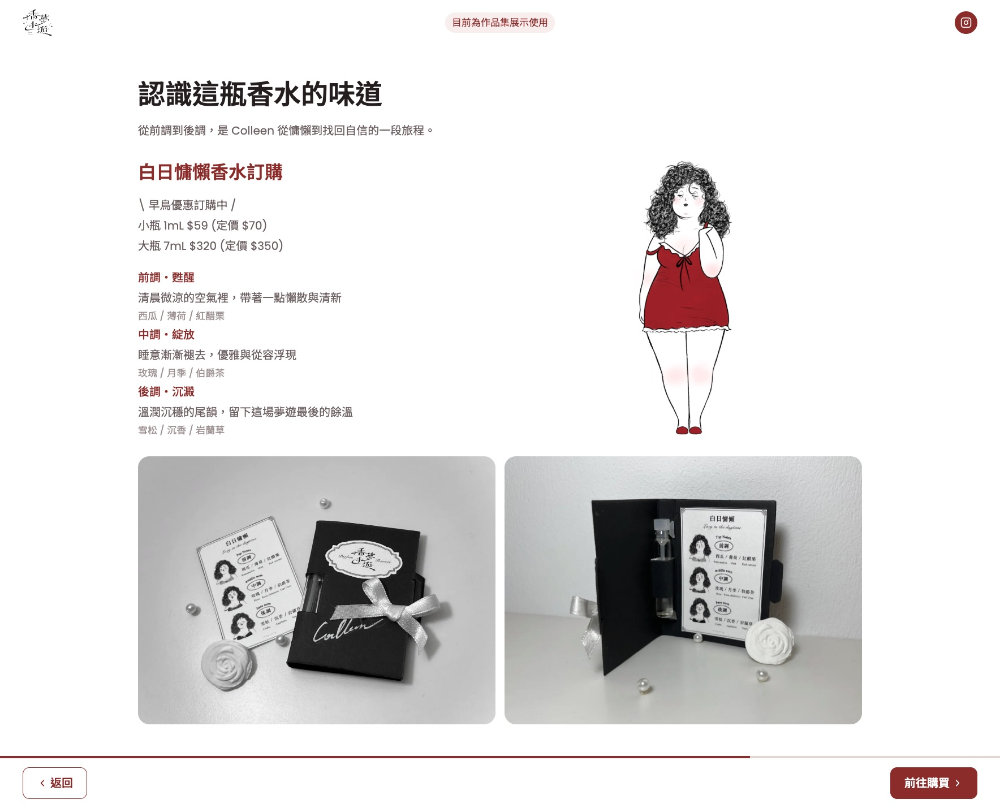
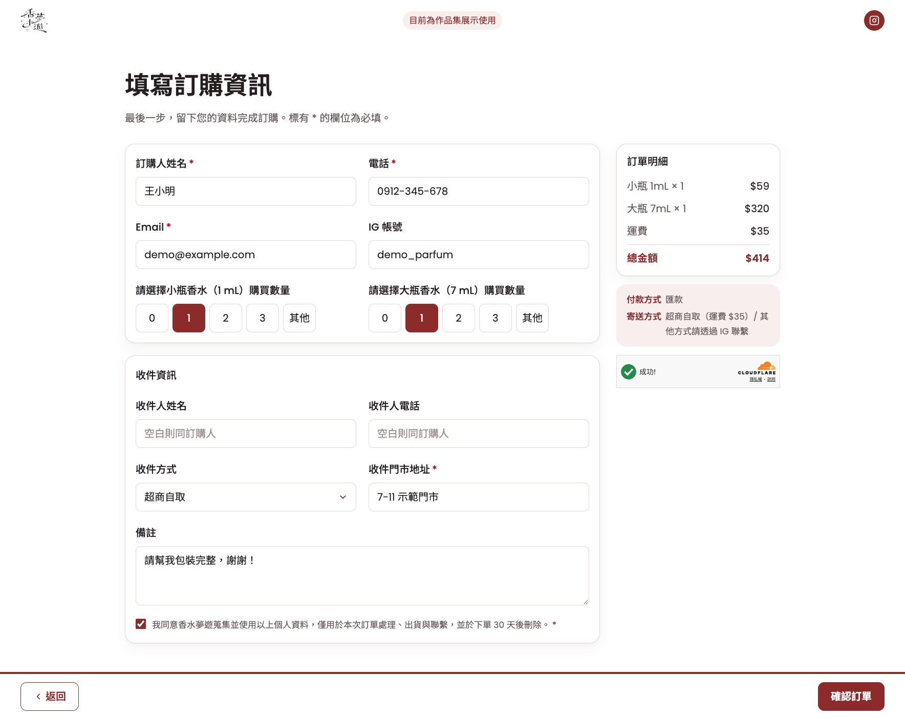
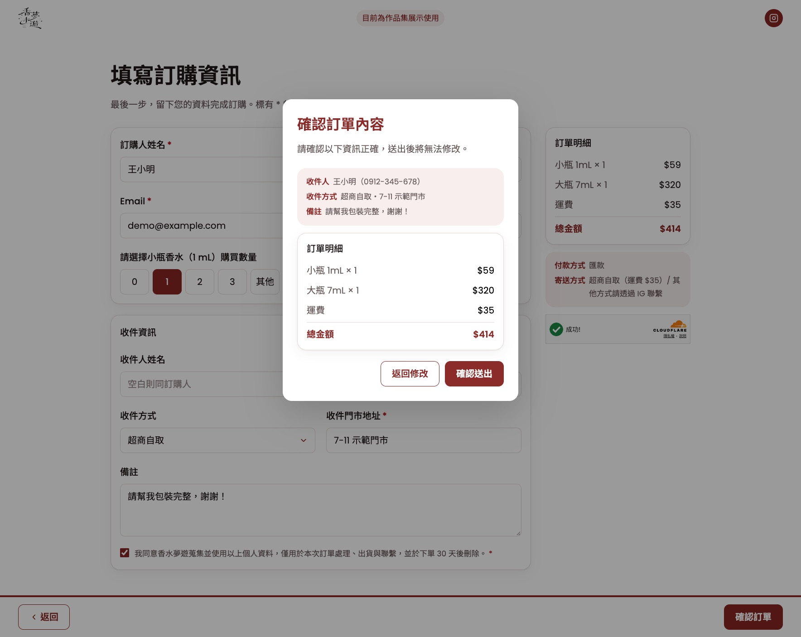
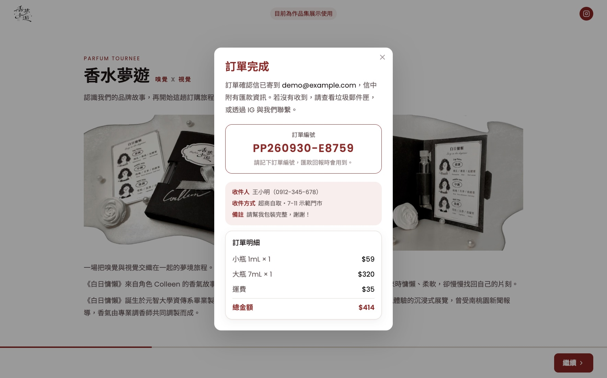
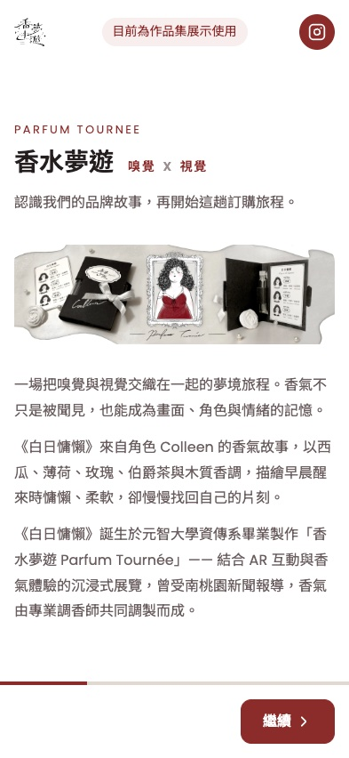
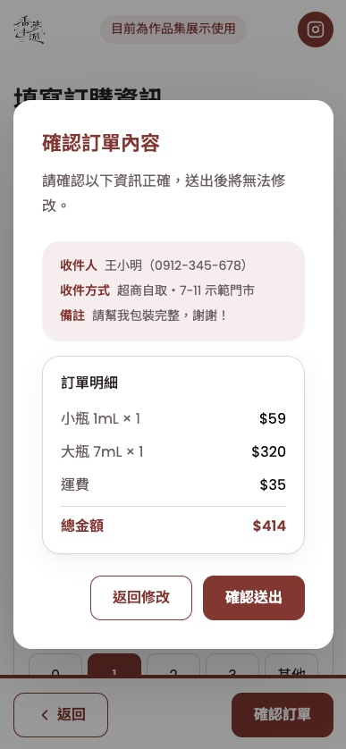
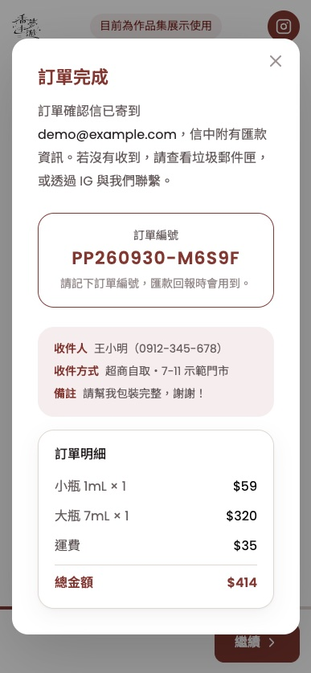
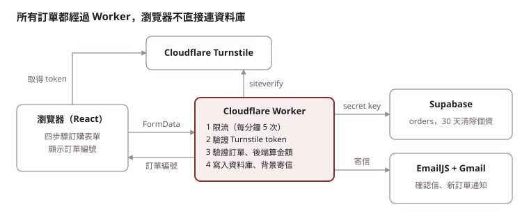

# 白日慵懶香水訂購網站

這是我畢業製作「香水夢遊 Parfum Tournée」的訂購網站重寫版。原本是純 HTML/CSS/JS 加 Google Sheet，這次改成 React 前端、Cloudflare Worker 後端，資料庫用 Supabase，從畫面到資料庫都自己做。

**線上展示：** https://pangpang-perfume-order.ykk910309.workers.dev/

> 目前是作品集展示用，還沒有正式開賣。



## 功能

- 四步驟訂購流程：品牌介紹 → 品牌影片 → 香味介紹 → 訂購表單，底部導覽列附進度條
- 訂購表單：訂購人、收件人、收件門市、備註、隱私權同意；必填欄位以 `*` 標示
- 選數量（小瓶／大瓶，也可以自己輸入），訂單明細和金額會即時更新
- 送出前會先跳確認視窗，送出後顯示訂單編號（例如 `PP260929-7K3QX`）
- 自動寄確認信給顧客（含匯款資訊），同時通知店家有新訂單
- 個資只留 30 天，到期自動清掉，只留統計用的資料
- RWD：手機到大螢幕都能看

## 畫面

<table>
  <tr>
    <td width="50%"><br>第二步：品牌影片</td>
    <td width="50%"><br>第三步：香味介紹與價格</td>
  </tr>
  <tr>
    <td><br>第四步：訂購表單，右側即時顯示明細與人機驗證</td>
    <td><br>送出前的確認視窗</td>
  </tr>
  <tr>
    <td colspan="2" align="center"><br>訂單完成：顯示訂單編號，確認信已寄出</td>
  </tr>
</table>

**手機版**

<table>
  <tr>
    <td width="33%"><br>品牌介紹</td>
    <td width="33%"><br>確認視窗</td>
    <td width="33%"><br>訂單完成</td>
  </tr>
</table>

截圖裡的訂購資料都是假資料。

## 架構



| 層 | 技術 |
| --- | --- |
| 前端 | React 19、Vite、Tailwind CSS v4、lucide-react |
| 後端 | Cloudflare Workers（API、靜態網站、Rate Limiting）、Cloudflare Turnstile |
| 資料庫 | Supabase（PostgreSQL），Worker 透過 REST API 寫入 |
| 寄信 | EmailJS + 店家 Gmail |
| 測試與檢查 | Vitest、Oxlint |

- 不做會員：訂單資訊直接寄確認信給顧客；就算寄信失敗，訂單還是會成立

## 技術亮點

**1. 前後端共用驗證，金額只由後端計算**

表單規則和價格放在 `shared/`，前端送出前、Worker 寫入前各檢查一次。瀏覽器傳來的金額我完全不信，一律由後端重算。22 個單元測試涵蓋數量、必填、長度上限和金額計算。

**2. 三層 API 防護，還補上第三方沒做好的地方**

限流（每個 IP 每分鐘 5 次）→ Turnstile 人機驗證 → 同一個 token 只能建一筆訂單。Turnstile 文件說 token 只能驗證一次，但我實測同一個 token 可以重複通過，所以把 token 的 SHA-256 雜湊存成 unique 欄位，讓資料庫擋掉重送（[B15](docs/bug-log.md)）。

**3. 自己實測找出金鑰外洩的風險**

做資安檢查時我發現，只要拿 repo 裡公開的 EmailJS Public Key，就能用店家的 Gmail 寄信。後來重建範本，新的 Template ID 只放在 Worker secret，再用舊 ID 模擬攻擊，確認已經失效（[S1](docs/improvements.md)）。

**4. 個資最小化**

前端不直接連資料庫，訪客沒有任何資料庫權限；log 只記錯誤代碼；訂單個資 30 天後由 pg_cron 自動清掉，只留統計資料。

## 專案結構

```text
src/                  # 前端
├── components/       # OrderForm（入口）、layout/、steps/、form/、order/、product/、icons/
├── hooks/            # useOrderSubmit（送出流程）、useDialog（原生 <dialog>）
├── data/             # 品牌故事、商品文案、圖片
├── services/         # 呼叫 /api/orders
└── index.css         # 設計系統（@theme、共用 class）
worker/               # 後端：index（路由、限流、排程）、orders、turnstile、email、keepAlive
shared/               # 前後端共用：驗證規則、金額計算、價格（含 22 個測試）
public/_headers       # 安全標頭（CSP 等）
wrangler.jsonc        # Worker 設定
supabase/schema.sql   # 資料庫結構、權限、個資清除排程
docs/                 # maintenance（維護手冊）、bug-log（錯誤紀錄）、improvements（檢查與改善）、roadmap（規劃與需求）
```

## 常見修改

| 要改的東西 | 位置 |
| --- | --- |
| 價格、運費 | `shared/pricing.js`（前後端同時生效） |
| 收件方式、數量與字數上限 | `shared/orderForm.js` |
| 文案、圖片 | `src/data/` |
| 顏色、字級 | `src/index.css` 的 `@theme`；共用 class：`field`、`btn`、`card`、`modal` |
| 介紹步驟 | `src/components/OrderForm.jsx` 的 `INTRO_STEPS` |
| 信件內容、匯款資訊 | EmailJS 後台的範本（不用部署） |
| 新增外部資源 | `public/_headers` 的 CSP 要放行 |

## 本機開發

```bash
npm install
npm run dev        # http://localhost:5173，網站與 /api/* 同時啟動
npx vitest run     # 單元測試
npm run lint       # 程式檢查
npm run build      # 輸出 dist/client 與 dist/pangpang_perfume_order
npm run preview    # 本機跑正式版（含安全標頭）
```

改了 `wrangler.jsonc` 或 `.dev.vars` 要重開 `npm run dev`。

## 環境變數

| 變數 | 類型 | 本機 | 正式環境 |
| --- | --- | --- | --- |
| `VITE_SITE_URL` | 公開（寫進前端） | `.env.local` | Build 變數 |
| `TURNSTILE_HOSTNAMES`、`EMAILJS_SERVICE_ID`、`EMAILJS_PUBLIC_KEY` | 公開 | `wrangler.jsonc`（`.dev.vars` 可覆蓋） | `wrangler.jsonc` |
| `SUPABASE_URL`、`SUPABASE_SECRET_KEY` | **機密** | `.dev.vars` | Worker secret |
| `TURNSTILE_SECRET` | **機密** | `.dev.vars` | Worker secret |
| `EMAILJS_PRIVATE_KEY`、`EMAILJS_CUSTOMER_TEMPLATE_ID`、`EMAILJS_OWNER_TEMPLATE_ID` | **機密** | `.dev.vars` | Worker secret |

- `.dev.vars` 和 `.env.local` 不能 commit；格式是 `名稱=值`
- 本機的 `TURNSTILE_HOSTNAMES=localhost`，正式環境只允許正式網址。Turnstile widget 要登記這兩個 hostname，Site Key 寫在 `src/components/form/TurnstileWidget.jsx`
- EmailJS 只要 Public Key 就能寄信，所以 **Template ID 一定要保密**，外洩就重建範本換新 ID；後台 Account → Security 要打開非瀏覽器 API 存取和 Use Private Key

## 資料庫（Supabase）

完整結構在 [`supabase/schema.sql`](supabase/schema.sql)，開一個新的 Supabase 專案，在 SQL Editor 整份貼上執行就能重建，重複執行也沒問題。

- 只有 `orders` 一張表；`order_number`、`turnstile_token_hash` 是 unique，金額欄位是 not null
- RLS 開著、沒有任何 policy；Worker（service_role）只有 `INSERT`、`SELECT`、`UPDATE`，訪客什麼權限都沒有
- pg_cron 每天台灣 03:00 自動清掉超過 30 天的個資，執行紀錄查 `cron.job_run_details`
- Worker 的 Cron Trigger 每天台灣 09:00 查一次資料庫（`worker/keepAlive.js`），避免免費方案閒置被暫停
- EmailJS 的 Email History 和店家 Gmail 的通知信每個月要手動清一次
- 在後台改了資料庫，`supabase/schema.sql` 也要跟著更新

## 部署

push 到 `main` 之後，Cloudflare Workers Builds 會自動部署（Build：`npm run build`，Deploy：`npx wrangler deploy`）。

- Build 變數：`VITE_SITE_URL`、`NODE_VERSION=22`
- Worker secret：上表標成機密的 6 個，用 `npx wrangler secret put <名稱>` 設定；在後台設的話類型要選 Secret
- 確認上線：`npx wrangler deployments list` 出現新版本，而且首頁 JS 換成新檔名
- 正式環境的 log：有開 Workers Logs，到 Cloudflare 後台 → Observability 查；想即時看用 `npx wrangler tail`

例行檢查、更新套件、回滾和出問題時怎麼查，寫在 [`docs/maintenance.md`](docs/maintenance.md)。開發時踩過的錯誤在 [`docs/bug-log.md`](docs/bug-log.md)，架構和資安的改善在 [`docs/improvements.md`](docs/improvements.md)，之後的規劃在 [`docs/roadmap.md`](docs/roadmap.md)。

## 未來規劃

詳細的規劃過程在 [`docs/roadmap.md`](docs/roadmap.md)。

- [ ] 訂單查詢：用訂單編號 + Email 查內容和狀態
- [ ] 訂單管理頁：登入後篩選、更新訂單狀態
- [ ] 匯款回報與出貨通知

## 授權

這個專案只作為作品展示，程式碼不開放重製或商業使用。
